<p align="center">
  
</p>

# Objetivo

Veremos duas abordagens diferentes de versionamento de API RST, mostrando as suas principáis características.

1. Versionamento via URI
2. Versionamento via Media Type

# Por quê versionar uma API REST

O primeiro motivo é com relação ao formato de dados. O formato define como os dados serão trocados entre um web server 
e um cliente.

Seja quando acessamos determinado site ou requisitamos alguma informação de uma API, ela vai trocar os dados conosco.

Esses dados podem ser definidos em alguns formatos, como JSON e XML.

Porém, a ideia é que seja disponibilizado nos dois. 

## XML

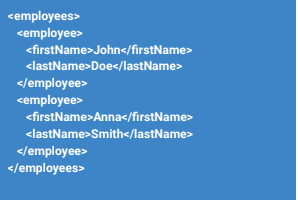

Para um serviço mais legado que permanecerá disponível.

## JSON

E disponibilizar também endpoints para serem consultados no formato JSON.

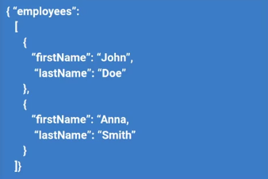

Logo, para termos ambos formatos, precisamos **versionar** a nossa API REST.

Mas podemos ter outro motivo também! Os dados podem ter uma mudança significativa por um determinado endpoint:

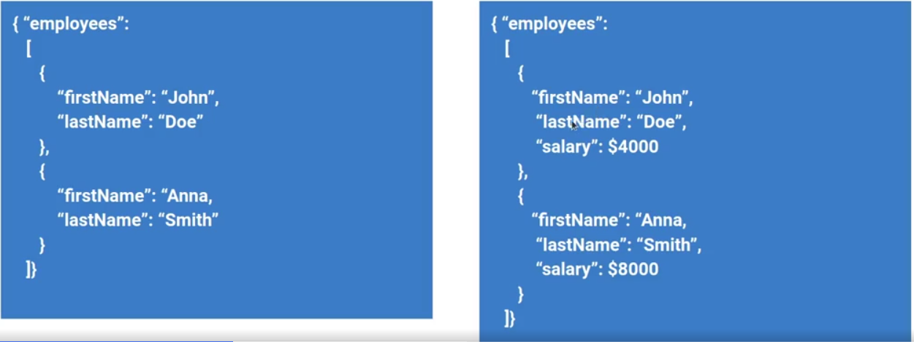

No exemplo acima, o JSON possui a propriedade salary! Podemos considerar o lado esquerdo como uma Versão 0 (padrão) e a
do lado direito como uma Versão 1.0.

# Versionamento via URI

A versão é indicada na própria URI (A URI direciona para as versões específicas)


Esse "v1", muda quando houver mudanças significativas nos dados da aplicação. 


As duas versões podem ser acessadas!

## Características

- Abordagem prática e simples de se implementar
- Quando a versão é incluída no espaço da URI, a representação do recurso é considerada imutável
- Não é recomendado que a versão seja mantida por um longo tempo
- Existe uma polêmica no uso desta abordagem

Muitas pessoas não recomendam versionamento via URI, pelo motivo 2 e 3.

# Versionamento via Media Type

Neste caso, a versão do recurso é indicada no cabeçalho da requisição. Também chamado de **versão de representação do 
recurso.**

Nesse ".name" do accept pode ser: nome da empresa/projeto.

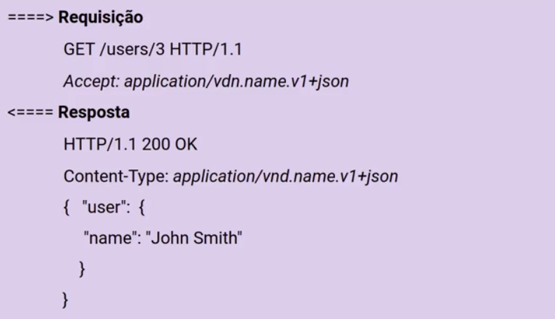

## Características

- A URi não muda. O que fazemos é especificar um media type customizado
- Nesta abordagem o cliente não faz nenhuma suposição em relação à estrutura do response (além do que é definido no
media type -a header-)
- Não fornece informações semânticas suficientes e necessita que o cliente forneça informações adicionais no cabeçalho.

# Prática - Via URI

Tenha em mente essa requisição do Postman do projeto DSMovie.

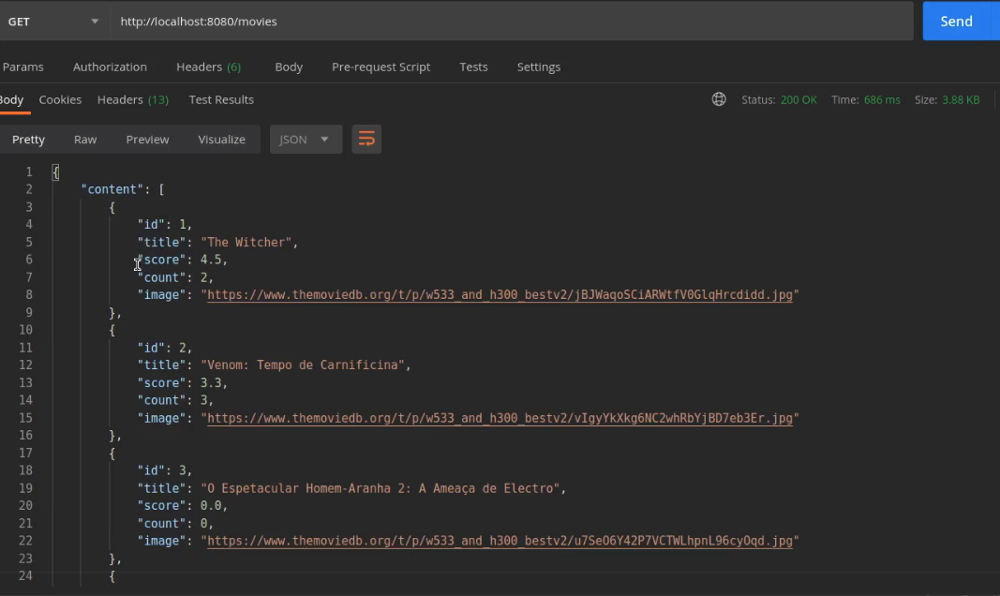

Imagine que a gente queira incluir o campo "gênero" nesse retorno, porém, mantendo a URL (tendo duas consultas na 
mesma URI). Faremos o versionamento de API.

## Entity

Iremos nas nossas entities (Movie) e criaremos um campo "gênero". Para isso, criaremos a entidade Genre.

```java
@Entity
@Table(name = "tb_genre")
public class Genre {
    
    @Id
    @GenerateValue(strategy = GenerationType.IDENTITY)
    private Long id;
    private String name;
    
    //construtor com e sem argumento + getters and setters
}
```
E agora lembramos do relacionamento, né? Um gênero pode ter vários filmes (Set). Em resumo, um OneToMany!

Movie recebe Genre com @ManyToOne e @JoinColumn.

Genre recebe Movie com @OneToMany e mappedBy.

Lembrar dos Getters e Setters.

## DTO

Agora precisamos ir para o DTO, visto que ele ainda não possui o campo Genre. A ideia não é mexer no MovieDTO já
existente, e sim criar um novo, com os mesmos atributos + genre!

Criaremos um MovieGenreDTO (lembrar de colocar também no construtor que troca de Entity para DTO):

## Controller

Agora sim começa o versionamento. Nós manteremos o endpoint "/movies". 

Clonaremos a classe MovieController. Ela chamará "MovieControllerV1".

Agora o findAll não retornará mais **MovieDTO** e sim **MovieGenreDTO**.

## Service

Diferente do Controller, não precisa criar um novo Service. Podemos simplesmente copiar a lógica do método findAll e
fazer as alterações.

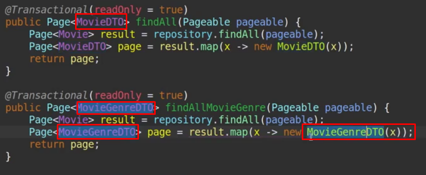

Podemos fazer a mesma coisa para o findById.

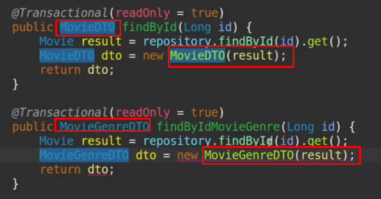

## Voltando ao Controller

Agora na nova classe criada não será "/movies" e sim "/v1/movies". 

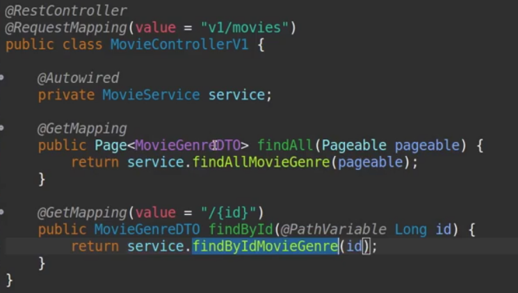

# Prática - Via Media Type

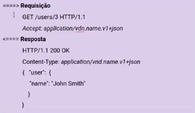

Agora nós vamos passar no cabeçalho um "accept:application/vdn.name.v1+tipo do dado"

## Controller

Vamos no MovieController e dar um Ctrl C + Ctrl V no método findAll.

No novo método faremos o seguinte:

1. O seu nome será findAllV1 
2. Retornará um MovieGenreDTO ao invés de MovieDTO
3. O service não usará mais o findAll e sim o findAllMovieGenre (criado na etapa de URI)

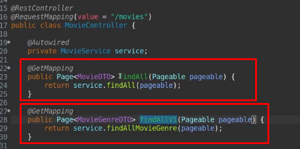

## Ok, e para inserir o cabeçalho?

Passaremos no GET do método no Controller.

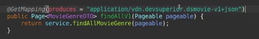

Mesma coisa no findById!

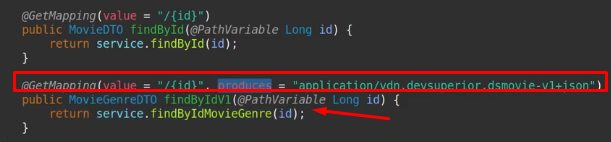

## Postman

Passamos no postman a URI padrão "/movies", porém em headers criaremos um campo "Accept" com o código passado dentro do
produces:

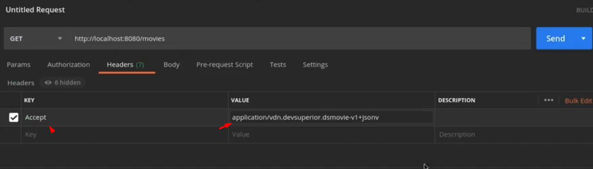

Com isso, ele trará o gênero.

Mesma coisa na requisição do findById, só criar uma header com o código do produces.